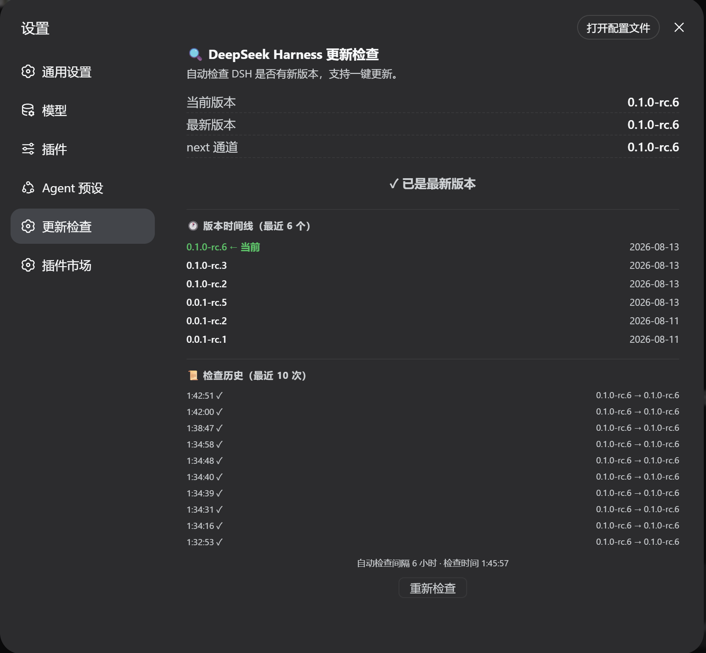

# dsh-update-checker

[English](README.md) | [中文](README.zh.md)

一个 [DeepSeek Harness](https://github.com/deepseek-ai/DeepSeek-Harness)（DSH）Web 插件：在侧边栏一键自检你的 DeepSeek Harness 是否有新版本。



> **中文**: 在侧栏一键自检 DeepSeek Harness 是否有新版本（本地 `dsh --version` vs npm 最新版）。
>
> **English**: Check DeepSeek Harness updates from the sidebar (local `dsh --version` vs npm `latest`/`next`).

## 功能特性

- 通过 `dsh --version` 读取本地版本
- 查询 npm registry 中 `@deepseek-ai/dsh` 的 `latest` / `next` 通道
- 语义化版本比较（正确处理 `rc` 预发布段，如 `0.1.0-rc.6 > 0.1.0-rc.3`）
- 侧栏底部按钮状态：`⟳` 空闲 / `…` 检查中 / `⬆` 有新版本 / `⚠` 检查失败
- 点击弹出面板：当前版本、最新版本、next 通道、状态徽章、检查时间、重新检查按钮
- 插件加载 1.5 秒后自动检查一次

## 安装

```sh
dsh plugin --profile web add dsh-update-checker
```

然后重启 `dsh web` 并打开界面，侧栏底部会出现 `⟳` 按钮。

> 源码安装 / 本地开发：
> ```sh
> dsh plugin --profile web add link:/绝对路径/dsh-update-checker
> ```

## 使用方法

点击侧栏底部的 `⟳` 按钮：

| 按钮 | 含义 |
|---|---|
| `⟳` | 空闲（等待中） |
| `…` | 检查中… |
| `⬆` | 发现新版本 |
| `⚠` | 检查失败（网络 / 解析） |

面板显示**当前版本**、**最新版本**、**next 通道**，以及状态徽章（`✓ 已是最新版本` / `⬆ 发现新版本`），还有检查时间和*重新检查*按钮。

## 工作原理

- **Host 端**：通过 `webServer` 服务注册 HTTP 路由 `/dsh-update-check`。本地版本用 Node 的 `execFileSync('dsh --version')` 读取；npm registry 数据用全局 `fetch` 抓取。
- **Client 端**：一个 `sidebar.footer.action` 条目（`__ModuleLoader__` CJS bundle，无需构建步骤），调用 `fetch('/dsh-update-check')` 并渲染按钮与面板。

## 项目结构

```
dsh-update-checker/
├── package.json        # dsh bundle patch + web client 声明
├── cordis.patch.yml    # 把插件行插入 profile 层栈
└── lib/
    ├── index.js        # Host 入口：HTTP 路由 + 版本比较
    └── client.js       # Client 入口：侧栏按钮 + 结果面板
```

## 许可证

MIT
